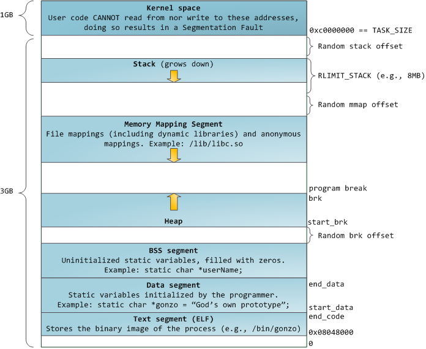
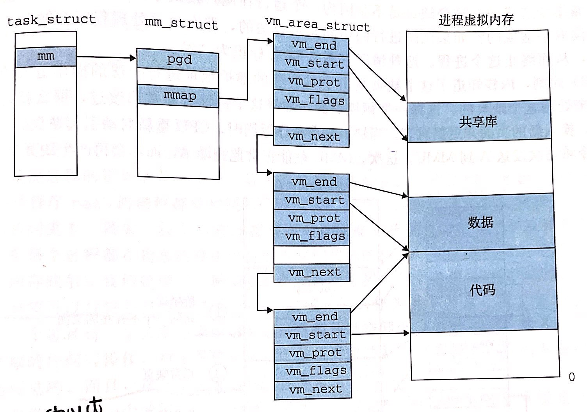

# 虚拟内存 / Virtual Memory / VM

**虚拟内存的基本概念**

---

在物理寻址的语境下，内存被看作一个由连续的字节构成的数组，每个字节都由一个唯一确定的地址号确定；访问某个字节时，我们指定地址就可以了。而这种方式给管理上带来了诸多不便（如 DRAM 空间有限、不同进程的地址空间管理复杂等），于是有了虚拟内存的概念。

我们规定一个虚拟地址空间：0 - N （可以简单理解为磁盘上的所有字节 或 我们支持访问的虚拟地址大小）；和一个物理地址空间：0 - M （内存的大小）；注意：N 往往远大于 M，所以我们将虚拟地址空间缓存在物理地址空间里。然后，我们以一个确定大小的块作为传输的基本单位，称为一个页（page），可以想见，整个虚拟地址空间被分为了很多页（虚拟页 / Virtual Page），物理地址空间也被分为了很多大小一样的页（物理页 / Physical Page）；显然，虚拟页可以有三种状态：[1] 未分配的（就是我们还没用到的）、[2] 缓存的（已经缓存在内存中，有对应的物理页）、[3] 未缓存的（未缓存在内存中）。在任意时刻，CPU 请求一个虚拟地址，由内存管理单元（Memory Management Unit / MMU）翻译为物理地址；若该页已缓存，则直接从内存中取回，若该页未缓存，则除法一个缺页异常，从磁盘拷贝到内存后，重新执行该指令取回。

**虚拟内存用作缓存工具 —— 操作比内存更大的空间**

---

其实，虚拟内存就是在磁盘上的一个大数组，按说磁盘够快的话，也不用这些复杂的缓存了；问题就是不够快，所以我们把部分页缓存在内存上，来加速访问。我们用数据结构页表（page table）来实现缓存的判断，每个条目称为一个 PTE （Page Table Entry）：

```cpp
// 简易页表结构
// 首位为标记位，标记是否缓存在 DRAM 中
| 1 |       addr_dram       | // 该页已缓存在 DRAM 中，起始地址为 addr_dram
| 0 |       addr_disk       | // 未缓存在 DRAM 中，磁盘上的地址为 addr_disk
| 0 |          null         | // 这个页还未分配
```

**再看 CPU 访问虚拟地址的例子。**CPU 发出访问虚拟地址 VP 的指令，MMU 结合 CR3（页表基址控制寄存器）找到对应的页表，查询到对应页的缓存情况，然后翻译为物理地址或触发缺页异常，最后从内存中取回数据。

* 页命中：页表中标志位为 1 ；表示已经缓存在 DRAM 中了，直接取回即可
* 缺页：页表中标志位为 0 ；表示页还在磁盘里，MMU 触发缺页异常，异常处理程序在磁盘上找到对应的页，选择 DRAM 上已缓存的一个页进行替换，然后返回给 CPU 重新执行刚才的取数据指令
* 分配页面：更新一下页表，将一个 PTE 标志位设为 0 并指向磁盘上的一个虚拟页的起始地址

**虚拟内存用作内存管理的工具 —— 方便的进程管理**

---

实际上，操作系统为每个进程都分配了一个页表，上下文切换时调整 CR3 来控制当前访问的页表。这带来了以下好处：

* 简化链接：由于每个进程都有自己的页表，所以对于相同的虚拟地址，实际上访问了不同的物理地址。进而，我们可以简化进程的构造，比如 linux 上进程总是拥有相同的构造，代码段总是从相同的虚拟地址开始：



* 简化加载：在我们加载目标文件的 .text（代码段）和 .data（数据段）时，加载器并不用直接拷贝他们到内存里，而是为他们在页表中分配指向磁盘地址的页，并将其标记为未缓存；当指令实际执行到某个地方时，再根据缺页进行加载
* 简化共享：当我们需要共享代码或者数据时，我们只需要通过页表将其映射到同一个物理页面即可
* 简化内存分配：当我们需要 k 个连续的页作为额外的堆空间时，只需要保证虚拟页的连续，而不需要保证物理页的连续

**虚拟内存作为内存保护的工具 —— 轻松区分权限问题**

---

实际上的页表并非像前述的那么简单，PTE 还有很多其他的位用来标记一些权限问题，如：

```cpp
// 用页表保护内存的大致思想
// SUP 表示只能由内核态访问
// READ 表示读权限
// Write 表示写权限
| SUP | READ | Write | addr |
|  0  |  1   |   0   |  PP0 |
|  0  |  0   |   1   |  PP1 |
|  1  |  1   |   1   |  PP2 |
```

**地址翻译**

---

[1] 最基本的模型

首先我们确定怎么拼凑出一个物理地址。

虚拟地址（VA）分为虚拟页号（Virtual Page Number / VPN）和虚拟页偏移量（Virtual Page Offset / VPO）；VPN 用来指定在某一页表中的页表条目号（PTE），VPO 用来表示指定地址相对页开头的偏移量；注意：此处的页表由页表基址寄存器（PTBR）指定。

```cpp
// VA
n-1        p p-1        0
|    VPN    |    VPO    |
// 一个页的大小为 2^p 字节，所以我们用 p 位的 VPO 就能表示一个页上的每一个地址
```

物理地址（PA）分为物理页号（Physical Page Number / PPN）和物理页偏移量（Physical Page Offset / PPO）

```cpp
// PA
m-1        p p-1        0
|    PPN    |    PPO    |
// 物理页大小和虚拟页大小一样，而总的地址空间不一样，所以总长度不一样
```

**再看 CPU 访问虚拟内存的例子。** MMU 根据 CR3 和 VPN 找到对应的 PTE，取回这个 PTE 的内容。如果该页已缓存，则用 PTE 中的 PPN 和 VPO（即 PPO）拼凑成一个完整的物理地址，取回数据；如果该页没有缓存，则触发缺页异常，用 PTE 中的 PPN 去磁盘上取回缺少的页，并完成内存中的页牺牲，告诉 CPU 重新执行；

[2] 加入高速缓存 SRAM

主要是注意，页表和数据都可以缓存在 SRAM 中，都会有命中和不命中。<span style="background-color: #ffaaaa">此处使用物理寻址。</span>

[3] 加入 TLB 缓存

每次都去内存中取 PTE 的开销比较大，我们在 MMU 中加入一个物理缓存，将最近用过的 PTE 都存起来，称作 Translation Lookaside Buffer（TLB）。TLB 的索引直接使用 VPN 中的特定位：

```cpp
// TLB
n-1                    p p-1        0
|          VPN          |    VPO    |
n-1      p+t p+t-1     p p-1        0
|   TLBT    |   TLBI    |    VPO    |
// 用一个 n - p - t 位的 TLBT 来确定缓存组
// 用一个 t 位的 TLBI 来索引每一组里的 PTE
```

其实就是加一个很快很快的硬件实现的 LRU

[4] 多级页表

如果我们按照现在这样只用一个页表来进行地址翻译，会发生什么呢？

对于一个进程，我们肯定需要维护它的一个页表，对于那些没有被分配的页，也会在这个页表里占据一个 PTE；随便举个例子，我们想访问一个大小为 2^48 （x86-64 / linux 的实际情况）字节的虚拟地址空间，页面的大小为 4KB （即 2^12 字节），那么总共有 2^36 个页，即 2^36 个 PTE；每个 PTE 都是 64 位即 2^3 字节；总共这个页表就需要 2^39 字节的空间 ≈ 550 GB 的空间；每个进程都搞这么个页表显然不现实。

我们用多级页表来解决这个问题。

现在用一个两级页表；一级页表中的一个 PTE 负责虚拟地址空间中的一个 4MB 的片（chunk），即 1024 个连续的页；二级页表中的一个 PTE  负责虚拟地址空间中的一个 4KB 的页；一级页表中的 PTE 指向二级页表中，一个片的 PTE 的开头。还是刚才的例子，访问一个 2^48 字节的虚拟地址空间，页大小 2^12 字节，片大小 2^22 字节，所以一级页表只需要 2^26 的大小（这是固定必须分配的），二级页表需要 2^12 大小；此时，二级页表只用按需分配，用到时再分配并在一级页表中标注。

实际中，比如 x86-64 / linux 使用四级页表。

[5] 一个例子

《CS: APP》p573 讲述了结合以上地址翻译的一个端到端的例子，比较好，值得看，笔记不再细讲。

**Core i7 和 Linux 内存系统**

---

* Core i7 地址翻译

目前 i7 使用 48 位的虚拟地址空间 + 52 位的物理地址空间；在虚拟地址中，VPN 被分为 4 段供四级页表做索引；PTE 中有一堆标志位，感觉暂时也用不到这么细，其中有几个有意思的：D 位（dirty），牺牲这一页时，是否需要写回磁盘；

* Linux 虚拟内存系统

和之前说的一样，在 Linux 中，每个进程都有自己的独立虚拟地址空间，其构造就像之前那个图。其中，内核虚拟内存的部分内容被映射到由所有进程共享的物理页面。

[1] 虚拟内存区域

Linux 中将虚拟内存组织成一些区域（area）的集合，区域就是有关联的一大段连续已分配虚拟页的连续片，例如数据段、代码段等。在内核中，维护着记录每个进程虚拟内存情况的数据结构 task_struct，其中包含内核需要知道的所有信息，比如 PID，栈指针、PC 等。task_struct 中就包含着对该进程虚拟内存情况的描述，由一个 mm_struct 结构记录。在其中，pgd 字段记录了一级页表的地址，mmap 指向一个 vm_area_struct 链表。顾名思义，vm_area_struct 描述一个该进程中的一个虚拟内存区域，它包含了区域的起始、结束、读写权限 和 共享/私有性质。如下图：



[2] 缺页异常处理

之前我们有提到，如果页表中（Linux 中为最后一级页表）没有命中，则会触发缺页异常。在 Linux 中处理程序会按以下顺序执行：

* 虚拟地址 A 是否合法？即 A 是否在某个区域结构的定义内，否则 segment fault
* 该内存访问是否合法？即有无读、写 或 执行 权限，否则 保护异常
* 以上都通过，则选择牺牲页面，替换并重新执行

**内存映射 —— Linux 对虚拟内存的精妙使用**

---

Linux 通过将虚拟内存区域与磁盘上的一个对象关联起来，以初始化这个区域。可以映射的对象为以下两种：

* 普通文件：将虚拟内存的一个区域映射到一个 Linux 文件系统中的普通文件的连续部分；
    * *** 注意：映射后，并不会将其拷贝到内存中，而是按需让缺页异常去拷贝

* 匿名文件：就是一大段 0 ，有一个奇怪的翻译，“请求二进制零页”；映射后将其标注为，”驻留在内存中的“
    * *** 注意：同样，映射后不会立即开辟一大段空间，而是按需去牺牲页，并直接把他们设为 0

*** 注意：这里的内存映射，我有一点理解困难。从高层次来说，映射了我们就可以在程序里操作这些玩意儿了，文件就可以读写，匿名文件就是一段可以用的数据段；从低层次来说，我们在进程中”声明“了一些虚拟内存区域，它映射到了文件或者一个内存段，当我们用到的时候就会发生拷贝，我们取消内存映射的时候，就会写回（文件）

完成内存映射的对象，都会在 swap 区和nei'cun

[1] 共享对象 / 私有对象

一个被映射到虚拟内存的对象，要么作为共享对象，要么作为私有对象。

* 共享对象：进程 A 对齐的写操作，对其他进程都是可见的，同时也会反映在磁盘的原始对象上
    * 因为每个对象都有一个唯一的文件名，所以内核可以快速地判定进程 A 已经映射了这个文件，所以直接将进程 B 中的 PTE 指向相应的物理页即可
    * 关键在于：即使一个对象被映射了 n 次，在物理内存上，也只会有一个副本；共享代码友好

* 私有对象：进程 A 对齐的写操作，对其他进程是不可见的，也不会反映在磁盘的原始对象上
    * 使用写时复制（copy-on-write / COW）技术来映射：映射为私有对象的 PTE 会被标注为只读，区域结构则被标记为私有的写时复制，若进程们都只读不写，那共享一个物理内存没有问题；一旦一个进程试图写某个页面，那么就会触发一个保护故障（和之前提到的缺页异常中的情况一样）；故障处理程序会在物理内存中创建这个页面的新副本，然后更新 PTE 的指向，返回后重新执行写操作即可

[2] fork 函数

* 进程 A 执行 fork 创建进程 B 后，内核会为 B 创建各种数据结构，并给一个新的 PID，然后为 B 创建一个和 A 一样的区域结构（mm_struct）
    * 可以想见，这个时候相当于 A 和 B 中的虚拟内存区域都是一样的

* 进程 A 和 B 中的每个页面都会被标记为只读，区域结构都会标记为私有写时复制
    * 此时 fork 返回，两个进程的虚拟内存区域还是一样的，相当于物理内存中仍然只有一份

* 一旦某个进程写了一些东西，就会触发保护故障，创建新页面副本，更新 PTE……

这样，即保证了两个进程私有的虚拟地址空间，又最大化地复用了物理内存

 [3] execve 函数

* 删除老的用户区域
* 映射私有区域：即新程序的代码段（.text）、数据段（.data）、未初始化数据段（.bss）、堆、用户栈
* 映射共享区域：共享库
* 设置程序计数器

[4] 使用 mmap 函数

```cpp
#include <unistd.h>
#include <sys/mman.h>

void *mmap(void *start, size_t length, int prot, int flags, int fd, off_t offset);
// start：希望的开始区域
// length：长度（字节）
// prot：虚拟内存区域的访问权限
// flags：被映射对象的类型：请求二进制零的、共享、私有
// fd：唯一文件描述符
// offset：距离文件开始处的偏移量
```

详见：《CS: APP》p586

**动态内存分配概述 —— 漂亮地维护一个虚拟内存区域**

---

我们的确可以用 mmap 搭配 munmap 函数，自己来创建和删除虚拟内存的区域，但是这样频繁的指针操作实在是不优雅也麻烦，所以有了动态内存分配。动态内存分配器维护着进程里的一个虚拟内存空间，堆。对于每个进程而言，内核中维护着 brk（break） 变量，指向堆的顶部。分配器将堆看作一个连续的块构成的，每个块要么是已分配的，要么是空闲的。分配器一般的，有两种风格：

* 显式分配器：C 中的 malloc / free，C++ 中的 new / delete；需要程序员显式地分配和释放块
* 隐式分配器：分配器会自动回收不再使用的块，比如 Java 里的 GC

C 中的动态分配函数

```cpp
#include <stdlib.h>

void *malloc(size_t size); // 分配一个 size 字节的块，若成功则返回分配块的指针，失败则返回 NULL // malloc 可以使用 mmap, munmap 或 sbrk 系统调用来实现
void free(void *ptr); // 释放一个已分配的块，ptr 必须是块的起始位置
```

为什么要使用动态内存分配？

好问题，我做了一些实验来验证我的猜想。以下是我的观点：

* 栈空间往往有限，大数组就必须得用堆
* 不使用动态分配的话，数据的大小往往得硬编码，这就不优雅了

**动态内存分配器的实现**

---

[1] 衡量好坏的指标

* 吞吐率：每秒完成的操作数（分配和释放）
* 内存利用率：完成一系列操作之后，已分配空间 / 堆的大小（就是说空了多少）

[2] 碎片

造成利用率低的原因就是有一些小的空闲碎片，新分配的老是比它们大，所以只能扩展堆，就老是用不上。

* 内部碎片：填充空间（对齐或最小块限制）
* 外部碎片：合起来够，但是分散在各地

[3] 几种实现方式简介

其实要实现一个分配器，无非就考虑几个方面：

* 空闲块的记录
* 将新分配的块放入合适的空闲块
* 放入后对空闲块的分割
* 释放后怎么合并空闲块，让其尽量大
* 怎么拓展堆

我总结的关键点，还是将整个堆抽象成怎样一个数据结构，尤其关注一系列对于空闲块的操作

1. 隐式空闲链表

隐式，就是说空闲块之间并没有直接相连，得去看才知道这个块是不是空闲的；我们给每个块加上这样的标注，让其成为一个链表：

```cpp
// 隐式空闲链表 header
31           3 2 1 0
|        块大小        | 0  0  1|

// 内容 及 填充
|            块内容             |
|             填充              |

// 隐式空闲链表 footer
31                    3  2  1  0
|         块大小       | 0  0  1|
```

*** 注意：我们要求块大小双字对齐的话，header 和 footer 的第三位必然为 0，所以我们用他们来记录空闲与否，1 为分配了，0 为空闲

*** 注意：footer 也可以不用，但是为了合并的高效最好加上

* 分配：由放置策略决定
    * 首次匹配：从头遍历链表，第一个放得下的空闲链表就放
    * 下一次匹配：不从头开始，从上一次结束搜索的地方开始
    * 最佳适配：找到适合请求大小块的最小空闲块

* 分割空闲块：为了避免内部碎片，把分配剩下的空闲块分割出去
* 获取额外堆内存：放不下了就申请跟多的空间，并标记为一个大块
* 合并空闲块：把前后的空闲块都合了就行了
    * 立即合并：释放的时候，就合并前后的
    * 推迟合并：直到后来的某个时刻再合并，比如分配失败过后，先扫描合并，再获取额外堆内存
    * *** 注意：如果不加 footer 相当于我们要再遍历一遍来找到前向的空闲块，或者做一个记录

*** 注意：<span style="background-color: #ffaaaa">这一块儿看起来很简单，其实写起来还是很多门道</span>，详见《CS: APP》p597 一个简单的分配器的实现（里面的宏真是精妙，各种类型转换，可能是因为我菜，所以觉得精妙）

1. 显式空闲链表

显式，就是说空闲的块显式地连接在一起了，不需要挨个去判断每个块是不是空闲的；我们给每个空闲块的 body 里加上两个指向 prev 和 next 空闲块的指针即可（因为反正空闲块的 body 也没用）。一个简单的双向链表。

可以想见，在释放一个块时，我们需要前后找空闲块，并修改指针，这个开销是线性的；而我们可以用特殊的排列来优化：

* LIFO 顺序：
* 地址顺序：

1. 分离的空闲链表

前面都是一个链表扛下了所有，我们完全可以用多个链表来更高效的实现。随便讲一个简单易懂的分离方式，我们将大小为 1 - 10 块分为一组放一个链表里，11 - 20 的块分一组放一个链表里……然后把所有链表的头放一个数组里，分离和释放都只用访问局部的一个小链表。有一些经典实现：

* 简单分离存储：每个链表中的块大小都一样，用来放某个大小类的块（如大小为 17 - 32 的块都放在一个块大小为 32 的链表里）；分配的时候不分割，释放的时候不合并，就填充，哎，就是玩儿~；分配的时候，找到对应的链表，如果为空就申请一些新的堆空间，分割为对应的块大小，如果不为空，就直接放在第一个；释放的时候，直接将释放的块放到队首就行了。*** 注意：只有空闲块才在链表里，已分配的块不在；
* 分离适配：比较没有新意的做法，却是普遍情况下最好的方法，GNU malloc 就用的这个；每个空闲链表都是之前提到的某种空闲链表，放着大小不一的处在当前大小类中的块；放置时先找到对应的大小类，做一个首次匹配，分割出来的块得扔到它对应的大小类里面去；
* 伙伴系统：分离适配的一种特例，用二分的思想，

**垃圾收集 —— GC**

---

在隐式分配器中，我们不用自己去释放动态分配的内存，垃圾收集器会自动回收。简介一个简单的策略：Mark & Sweep

我们将内存视为一个有向可达图，根节点是不在堆中的，它可能是寄存器、栈、读写数据区中的变量；凡是从根节点不可达的，我们都称之为垃圾，把它清理掉。Mark & Sweep 就是说在标记阶段，我们把可达的都标记了，在清除阶段，把没标记的块都释放了。

**小结**

---

这一章还是比较难理解的，读了好多遍书，配合 15213 的课程才啃了个七七八八。首先是了解了虚拟内存的意义和工作机制，进而通过实际的例子强化了这一过程；进而继续向上层跳，看 Linux 中是怎么玩儿虚拟内存区域的，引申出了动态内存分布这个东西。学这一章如果能一边自己写小例子，一边 Google 一些疑点的话，效果比较好，因为好多东西，讲的并不是特别深，会有一种一知半解的烦恼。
